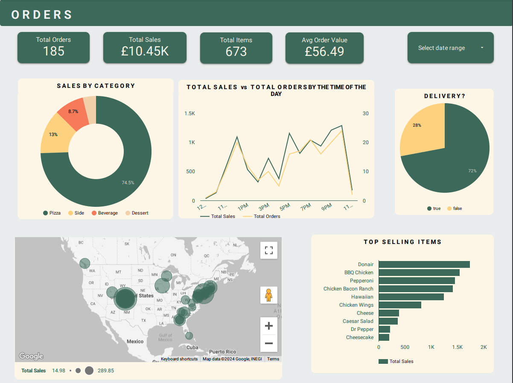
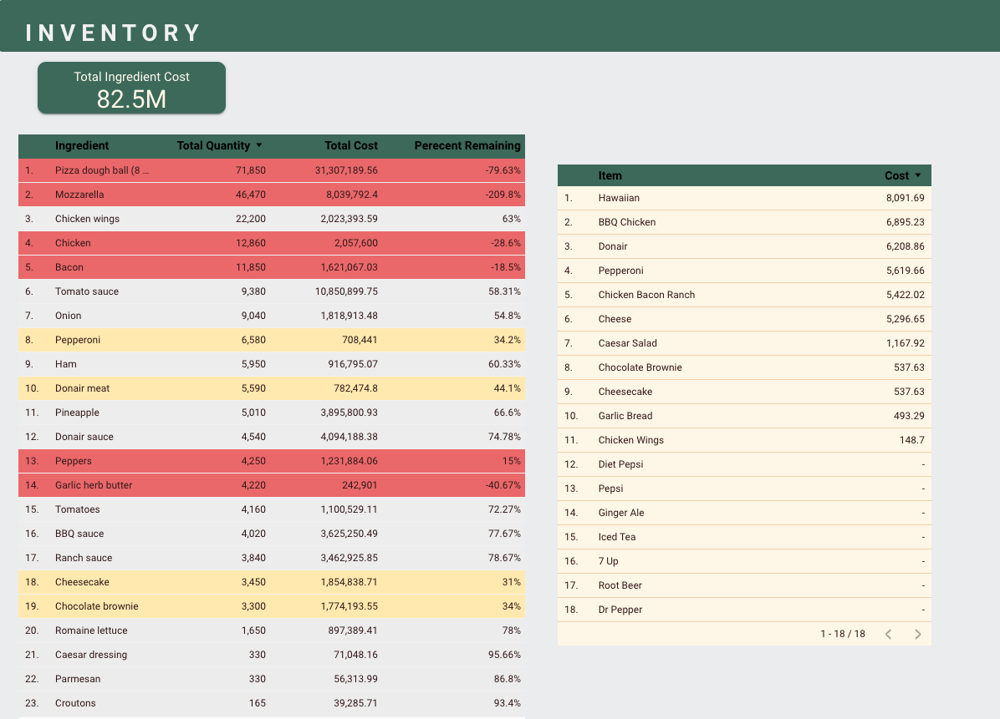
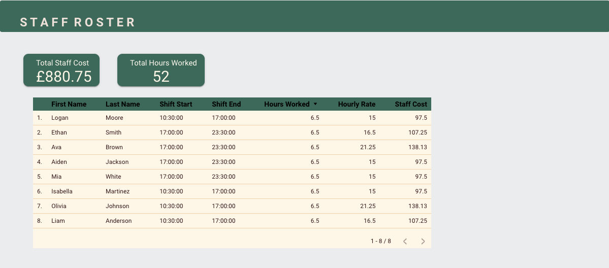

# Pizza Restaurant Data Analysis with SQL

This repository contains SQL scripts for creating a database schema based on a pizza restaurant's operations data. The data includes orders, inventory, staff management, and ingredient usage. The SQL queries focus on extracting insights related to sales performance, inventory management, and staff costs using Looker for data visualization.

Overview
This project simulates how SQL can be used to manage and analyze data for a pizza restaurant. The analysis includes:

Sales Performance: Tracking orders and item categories.
Inventory: Calculating stock usage and remaining inventory.
Staff Management: Calculating labor costs based on staff shifts.

Database Schema
Tables included in the schema:

Address: Delivery address details.
Customers: Customer details.
Ingredients: Ingredient details such as weight, unit price, and measurement.
Inventory: Stock levels of each ingredient.
Item: Menu items available in the restaurant.
Orders: Contains information on individual orders.
Recipe: Information on how ingredients are used in each menu item.
Rota: Staff schedule, showing which staff members worked which shifts.
Shift: Details of each staff member's shifts.
Staff: Employee details and hourly rates.

SQL Scripts
Create Tables
Here's a sample of how the tables are created:

```sql
CREATE TABLE raw.address (
    add_id int PRIMARY KEY,
    delivery_address1 character varying(25),
    delivery_address2 character varying(10),
    delivery_city character varying(15),
    delivery_postcode character varying(10)
);

CREATE TABLE raw.orders (
    row_id int PRIMARY KEY,
    order_id bigint,
    created_at timestamp without time zone,
    item_id TEXT,
    quantity numeric,
    cust_id integer,
    delivery boolean,
    add_id integer
);
```

### Sample Queries

1. Order Activities:

```sql
SELECT 
 o.order_id,
 i.item_price,
 o.quantity,
 i.item_cat,
 i.item_name,
 o.created_at,
 a.delivery_address1,
 a.delivery_address2,
 a.delivery_city,
 a.delivery_postcode,
 o.delivery
FROM 
	raw.orders o
	LEFT JOIN raw.item i on o.item_id = i.item_id
	LEFT JOIN raw.address a on o.add_id=a.add_id
```

2. Ingredient Cost:

```sql
SELECT  
s1.item_id,
s1.item_name,
s1.ing_id,
s1.ing_name,
s1.ing_weight,
s1.ing_price,
s1.recipe_quantity,
s1.order_qty,
ROUND ((s1.recipe_quantity * s1.order_qty),2) as ordered_weight,
ROUND((s1.ing_weight/s1.ing_price),2) as ing_unit_price,
ROUND ((s1.recipe_quantity * s1.order_qty) * (s1.ing_weight/s1.ing_price),2) as total_ing_cost

FROM (SELECT
o.item_id,
i.sku,
i.item_name,
r.ing_id,
ing.ing_name,
ing.ing_weight,
ing.ing_price,
r.quantity as recipe_quantity,
sum (o.quantity) order_qty
FROM 
	raw.orders o
	LEFT JOIN raw.item i on o.item_id = i.item_id
	LEFT JOIN raw.recipe r on i.sku = r.recipe_id
	LEFT JOIN raw.ingredients ing on r.ing_id = ing.ing_id
GROUP BY 
	o.item_id,
	i.sku,
	i.item_name,
	r.ing_id,
	r.quantity,
	ing.ing_name,
	ing.ing_weight,
	ing.ing_price) s1
```

3. Remaining Inventory:

```sql
SELECT 
	s2.ing_name,
	s2.ordered_weight,
	(ing.ing_weight * i.quantity) total_inv_weight,
	((ing.ing_weight * i.quantity)-ordered_weight) remaining_weight
FROM (SELECT 
	ing_id,
	ing_name,
	SUM(ordered_weight) ordered_weight
FROM staging.stock1 
GROUP BY 
	ing_id,
	ing_name)s2
LEFT JOIN raw.inventory i ON i.ing_id = s2.ing_id	
LEFT JOIN raw.ingredients ing ON ing.ing_id = s2.ing_id	
	
	
SELECT 
	s.ing_id,
	i.inv_id,
	i.quantity,
	s.ing_name,
	s.ing_weight,
	SUM(ordered_weight) ordered_weight
FROM staging.stock1 s
LEFT JOIN raw.inventory i on i.ing_id=s.ing_id
GROUP BY 
	s.ing_id,
	i.inv_id,
	i.quantity,
	s.ing_name,
	s.ing_weight
```

4. Staff Costs:

```sql
SELECT 
 r. date,
 st.first_name,
 st.last_name,
 st.hourly_rate,
 sh.start_time,
 sh.end_time,
 ROUND(EXTRACT(HOUR FROM (sh.end_time - sh.start_time))+ (EXTRACT(MINUTE FROM (sh.end_time - sh.start_time))/60),2) hours_worked,
 (ROUND(EXTRACT(HOUR FROM (sh.end_time - sh.start_time))+ (EXTRACT(MINUTE FROM (sh.end_time - sh.start_time))/60),2)) * st.hourly_rate AS staff_cost
 FROM raw.rota r
 LEFT JOIN raw.staff st ON st.staff_id = r.staff_id
 LEFT JOIN raw.shift sh ON sh.shift_id = r.shift_id

```

## Dashboards

### Orders 



This dashboard provides a comprehensive view of order activity, including:

1. Total orders
2. Total sales
3. Total items sold
4. Average order value
5. Sales by category
6. Top selling items
7. Orders by hour
8. Sales by hour
9. Orders by address
10. Orders by delivery/pick up

These metrics allow us to track overall sales performance, identify popular items and categories, understand peak order times, and analyze delivery patterns.

### Inventory 



This dashboard focuses on inventory management, which is crucial for maintaining efficiency and profitability. It includes:

1. Total quantity by ingredient
2. Total cost of ingredients
3. Calculated cost of pizza
4. Percentage stock remaining by ingredient
5. List of ingredients to re-order based on remaining inventory

This information helps in calculating how much inventory is being used, identifying ingredients that need restocking, and determining the cost of each pizza based on its ingredients. This data is essential for pricing decisions and maintaining profit margins.

### Staff Roster 



This dashboard helps monitor staff scheduling and costs:

1. Total staff cost
2. Total hours worked
3. Hours worked by staff member
4. Cost per staff member

These metrics allow management to track labor costs, optimize scheduling, and ensure efficient staffing levels during different shifts.

## Key Insights

Based on the dashboard data, here are some key insights:

1. **Sales Performance**:
   - The restaurant has processed 185 orders with total sales of £10.45K.
   - Pizza is the dominant category, accounting for 74.5% of sales.
   - The average order value is £56.49.
   - 72% of orders are for delivery.
   - Top selling items are Donair, BBQ Chicken, and Pepperoni pizzas.

2. **Inventory Management**:
   - The total ingredient cost is £82.5M.
   - Some ingredients are critically low or overstocked (e.g., Pizza dough ball at -79.63%, Mozzarella at -209.8%).
   - The highest cost menu items are Hawaiian, BBQ Chicken, and Donair pizzas.

3. **Staff Management**:
   - Total staff cost for the period shown is £880.75 for 52 hours worked.
   - Staff shifts are split between 10:30-17:00 and 17:00-23:30.
   - Hourly rates range from £15 to £21.25.

## Technologies Used

* **SQL**: Used for database creation, queries, and data manipulation.
* **Looker**: BI tool used to visualize the data from the SQL queries.
* **PostgreSQL**: Database management system used to store the pizza restaurant data.

## How to Use

1. **Clone this repository**:
   ```bash
   git clone https://github.com/yourusername/pizza-restaurant-analysis.git
   ```

2. **Set up the database**:
   * Use the provided SQL scripts to create the tables in a PostgreSQL database.

3. **Insert sample data**:
   * Populate the tables with sample data (orders, ingredients, staff schedules).

4. **Run queries**:
   * Use the provided SQL queries to extract sales, inventory, and staff cost insights.

5. **Visualize in Looker**:
   * Import the data into Looker to build dashboards for tracking sales, inventory, and staff performance.

## Contact

Feel free to reach out via [LinkedIn](https://www.linkedin.com/in/mirasha-perera/) or visit my [Portfolio Website](https://www.mirasha-perera.com/) for more projects.
